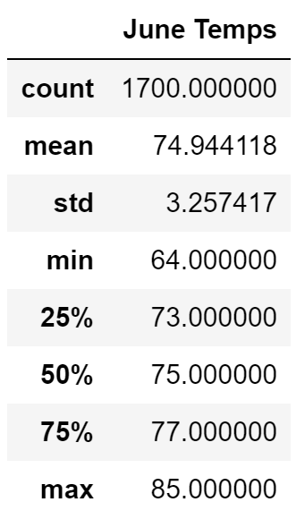
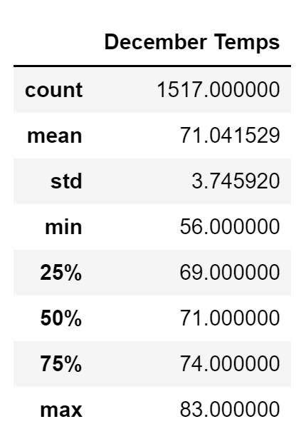

# surfs_up

## Overview of Project
 
### Purpose

The purpose of the project is to analyze weather data using the SQLalchamy library in Python in order to create a summary table based off of a SQLite database.

## Results

### Retirement Analysis Results

- The average temprature is lower in December than in June

- June has more recorded tempratures than in December

- The temprature has a wider distribution in December than in June.

## Summary

The following image shows the temprature summary for June

The following image shows the temprature summary for December

